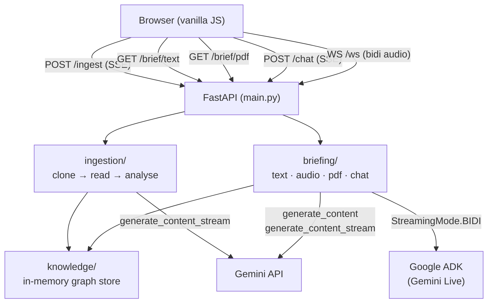
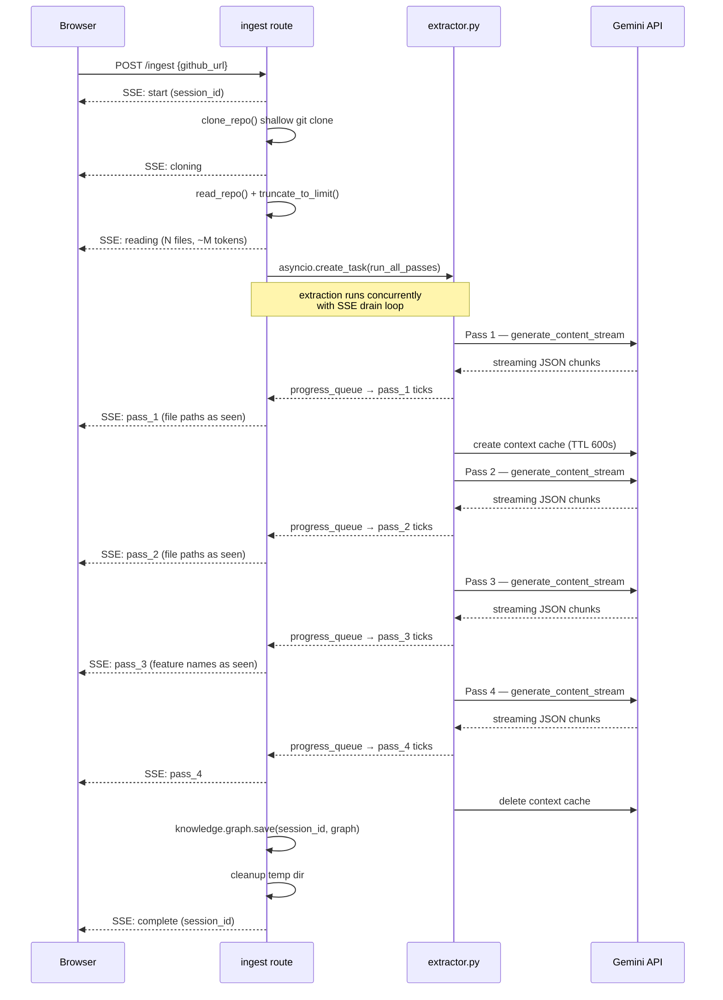
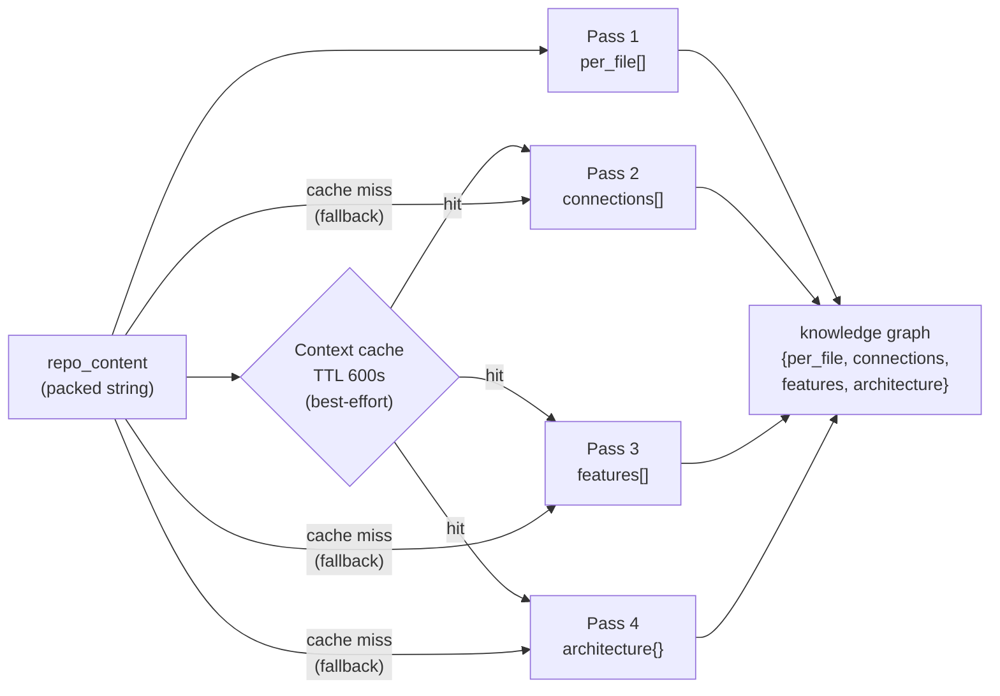
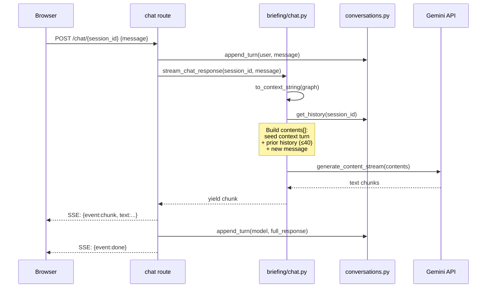
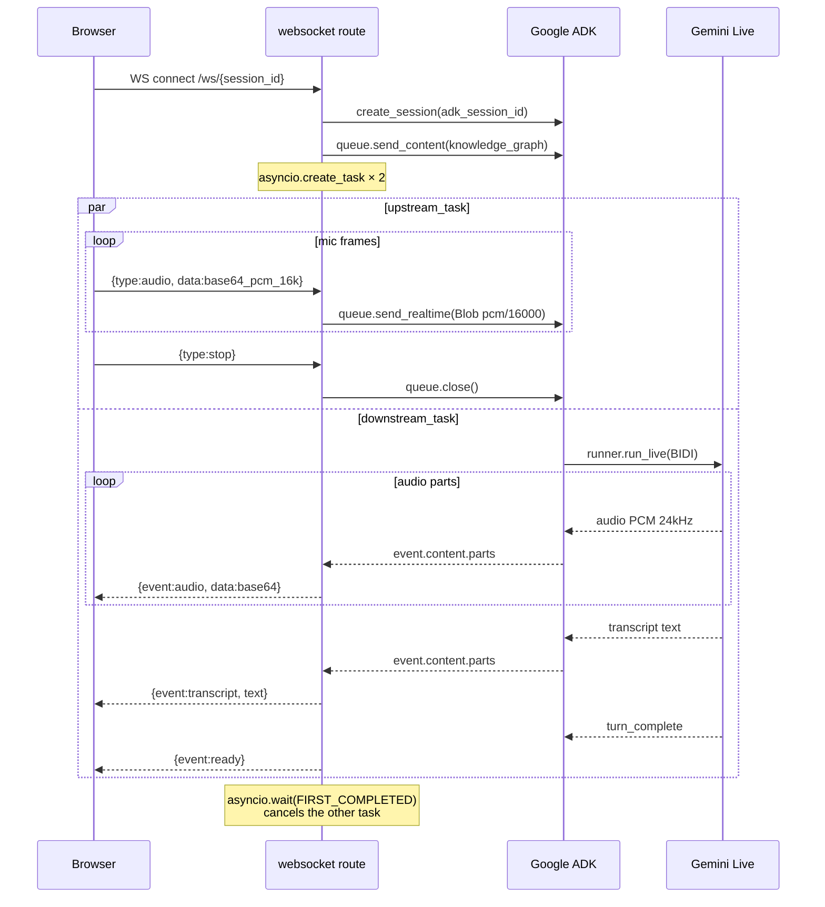
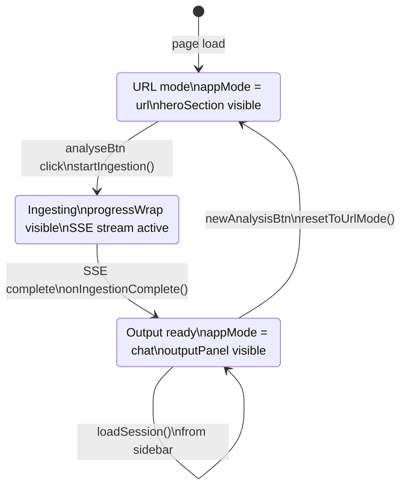
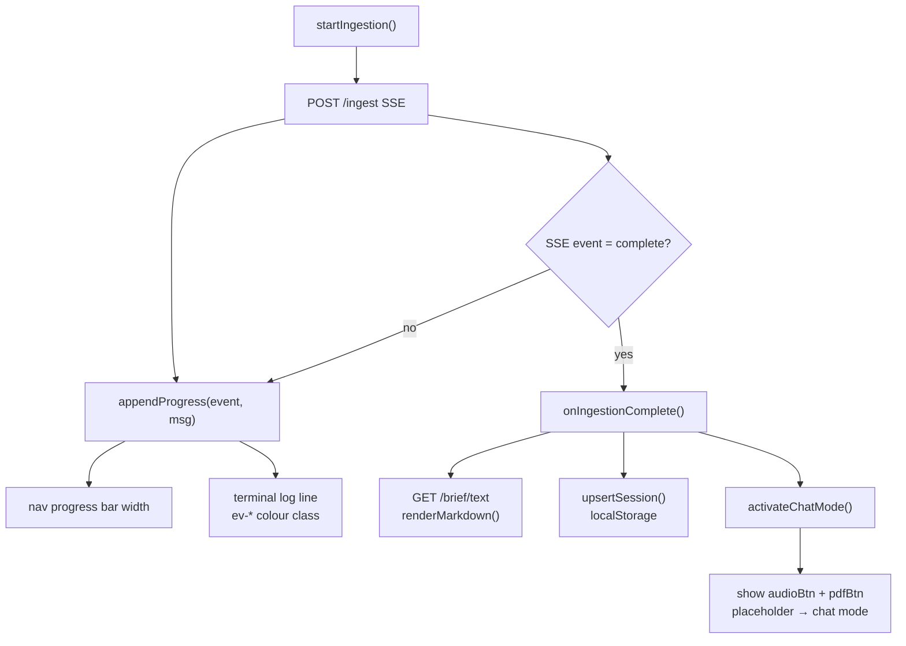
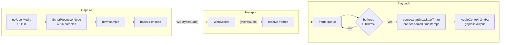
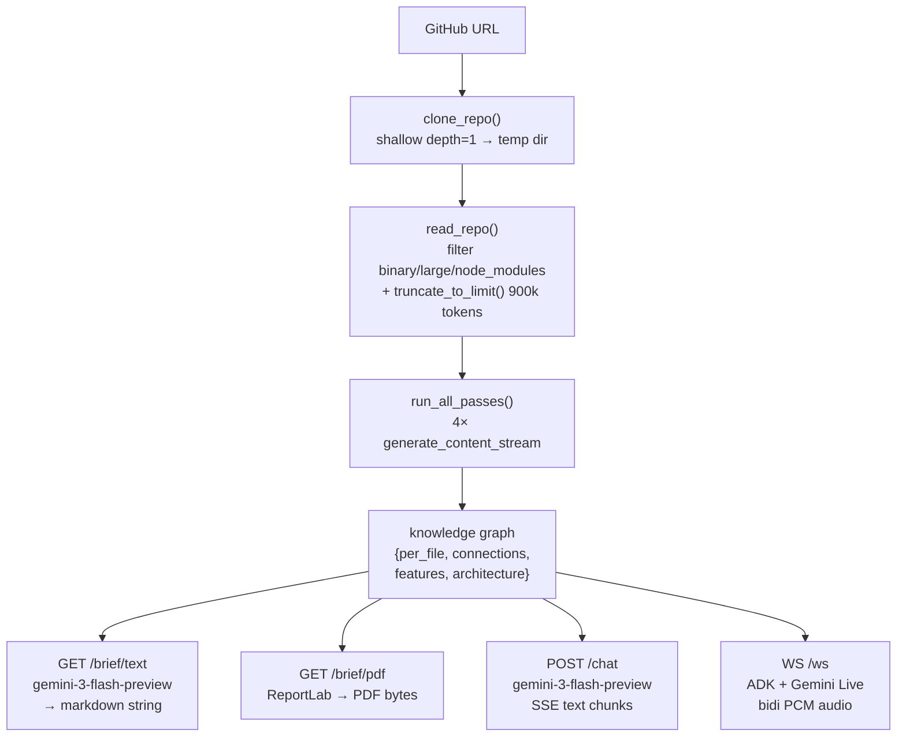

# Compass — Architecture

## Overview

Compass is a single-server web application. FastAPI serves both the REST/WebSocket API and the static frontend from the same process. There is no database — all state is held in two in-memory Python dicts (knowledge graphs and conversation histories) and in the browser's `localStorage`.



---

## Request lifecycle

### 1. Ingestion (`POST /ingest`)



The extraction task and the SSE drain loop run concurrently. `extractor.run_all_passes()` puts progress events into an `asyncio.Queue`; the route generator drains that queue with a 1-second timeout that acts as a heartbeat to keep the SSE connection alive through proxies.

### 2. 4-pass analysis pipeline (`ingestion/extractor.py`)

Each pass streams Gemini output with `generate_content_stream` and regex-scans the accumulating JSON for entity names (file paths, feature names) to emit progress ticks in real time before the full response is parsed.



| Pass | Prompt asks for | Progress ticks on |
|---|---|---|
| 1 | `per_file` array — purpose, functions, imports, key logic | Each `"path"` field seen |
| 2 | `connections` array — calls, called_by, data_flow | Each `"path"` field seen |
| 3 | `features` array — feature name, files, entry point, description | Each `"feature"` field seen |
| 4 | `architecture` object — pattern, language, framework, conventions, rules | pattern/language/framework fields |

The four pass results are merged into a single knowledge graph dict:

```python
{
  'per_file':     [...],   # list of file objects
  'connections':  [...],   # list of connection objects
  'features':     [...],   # list of feature objects
  'architecture': {...}    # single object
}
```

### 3. Knowledge graph store (`knowledge/graph.py`)

A module-level `dict[str, dict]` keyed by `session_id`. No persistence — graphs are lost on server restart. `to_context_string()` flattens the graph to a compact ~8 000-token string used as context injection for all downstream outputs (text brief, chat, audio brief).

> **Production note:** replace `_store` with Redis + 2-hour TTL.

### 4. Text brief (`GET /brief/text/{session_id}`)

Loads the graph, calls `to_context_string()`, and sends a single non-streaming `generate_content` call to `gemini-3-flash-preview` with a fixed formatting prompt. Returns `{ brief: string, graph: dict }` — the `graph` field is used by the frontend after ingestion.

### 5. Chat (`POST /chat/{session_id}`)

SSE-streamed multi-turn chat grounded in the knowledge graph.



Chat history is also persisted in `localStorage` on the client and replayed on session load, so the UI survives server restarts.

### 6. Audio brief (`WebSocket /ws/{session_id}`)

Uses Google ADK (`google-adk`) for bidirectional audio via Gemini Live.



- **Agent singleton** (`briefing/agent.py`): `Agent` + `Runner` + `InMemorySessionService` — initialised once at import time.
- **Model**: `gemini-2.5-flash-native-audio-preview-12-2025`
- **Streaming mode**: `StreamingMode.BIDI` — full-duplex
- **Voice**: Charon (prebuilt)

### 7. PDF (`GET /brief/pdf/{session_id}`)

Generates the text brief, then renders it to a PDF in memory using ReportLab. Returned as `application/pdf` with `Content-Disposition: attachment`.

---

## Frontend architecture (`frontend/`)

Single HTML file with two JS modules. No build step, no framework.

### State model



```
localStorage['compass_sessions']: Session[]
  Session {
    sessionId, repoName, repoUrl, createdAt,
    textBrief,        ← full markdown string
    chatHistory[]     ← {role, text}[], capped at 40
  }
```

Sessions are the single source of truth for the sidebar. The server holds nothing the browser needs to restore a session — it only needs a live server for new chat messages.

### Ingestion flow (JS)



### Audio pipeline (JS — `audio-manager.js`)



---

## Data flow at a glance



---

## Limits and known constraints

| Constraint | Value | Where enforced |
|---|---|---|
| Max file size per repo file | 100 KB | `reader.py` |
| Context window target | 900 000 tokens | `reader.py:TOKEN_LIMIT` |
| Context budget for graph string | ~8 000 tokens | `graph.py:to_context_string()` |
| Chat history cap (server) | 40 entries | `conversations.py` |
| Chat history cap (client) | 40 entries | `main.js` |
| Sessions retained (localStorage) | 20 | `main.js:saveSessions()` |
| Context cache TTL | 600 s | `extractor.py` |
| Audio jitter buffer | 180 ms | `audio-manager.js:JITTER_MS` |
| Mic sample rate | 16 kHz | `audio-manager.js` |
| Playback sample rate | 24 kHz | `audio-manager.js` |

---

## What is not persistent

- **Knowledge graphs** — in-memory Python dict, lost on server restart
- **Conversation history** — in-memory Python dict, lost on server restart
- **ADK sessions** — `InMemorySessionService`, lost on server restart

The browser `localStorage` cache (text brief + chat history) means users can still read past briefs and chat history after a server restart; they just can't send new chat messages to sessions the server no longer holds.
