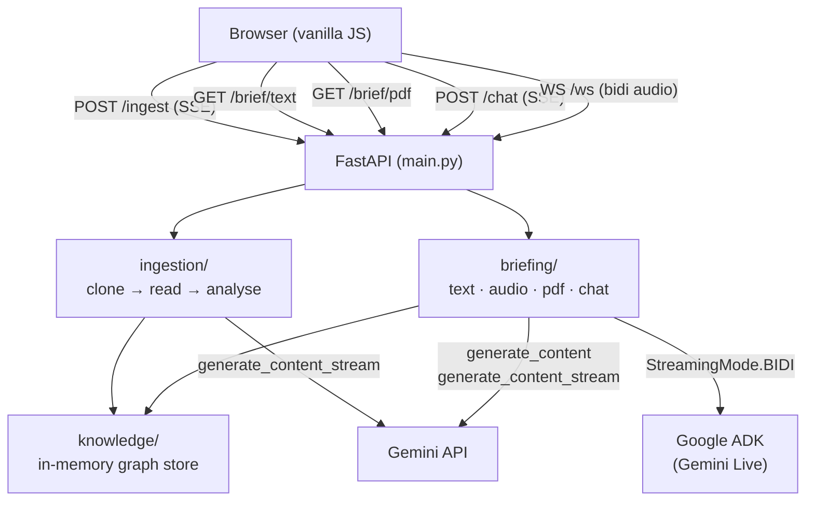
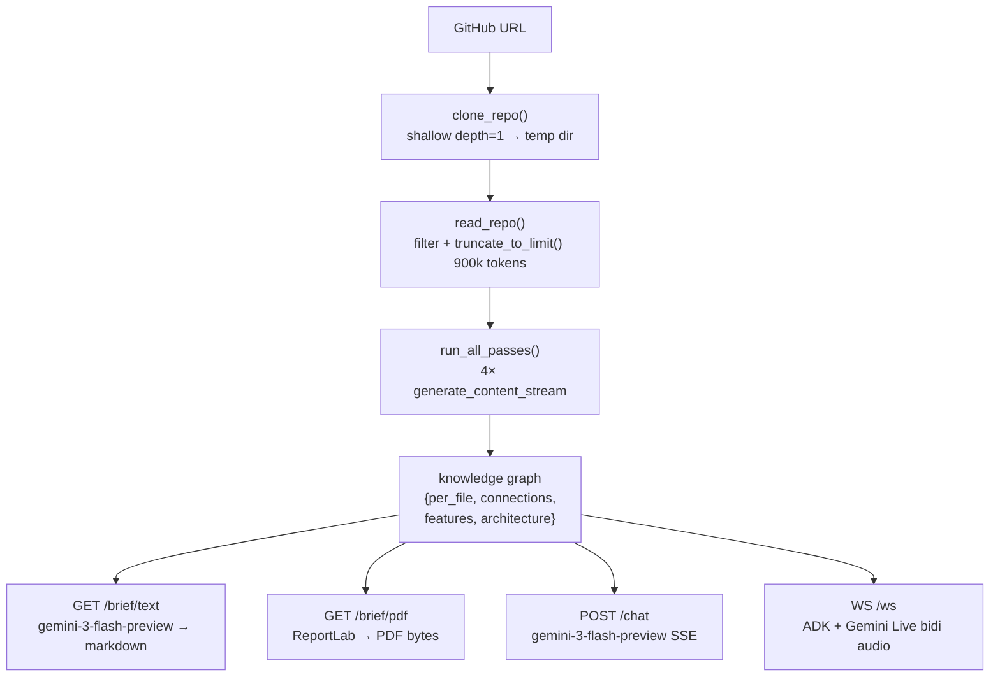
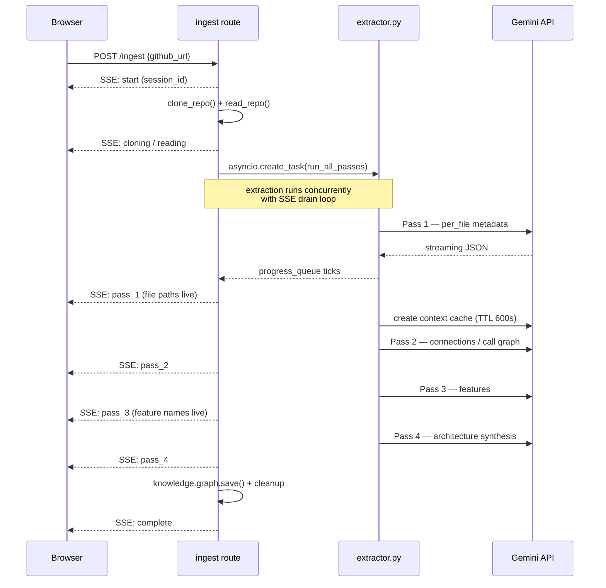
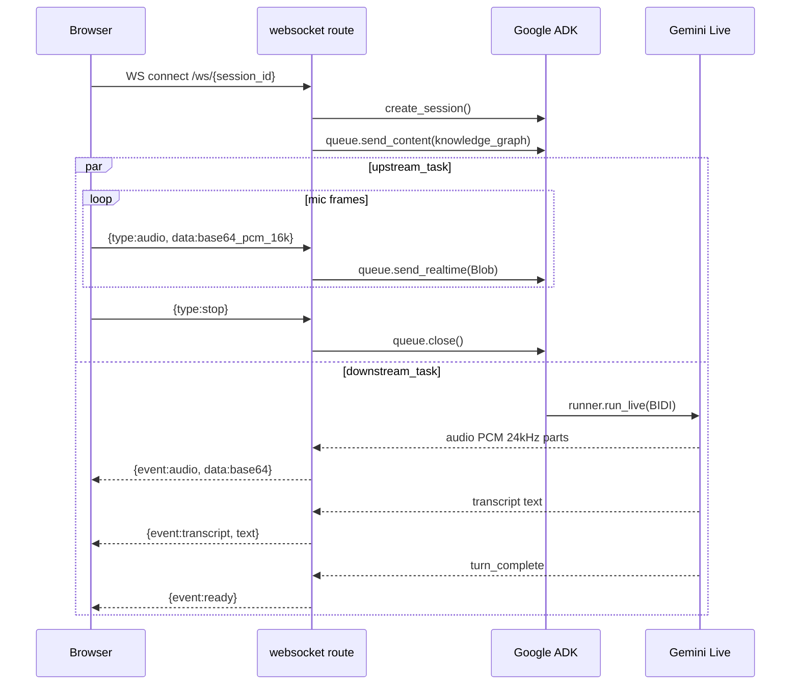

# Compass

Paste a GitHub URL. Get an instant AI-generated brief of the codebase — text, audio, and PDF — plus a live chat interface to ask questions about the code.

---

## What it does

1. **Clones** any public GitHub repo into a temp directory
2. **Analyses** it with a 4-pass Gemini pipeline that builds a knowledge graph (file purposes, call graph, features, architecture)
3. **Generates** a structured text brief you can read in 90 seconds
4. **Streams** an audio brief via bidirectional voice using Google ADK + Gemini Live
5. **Exports** a PDF brief via ReportLab
6. **Chats** — after analysis you can ask anything about the codebase in a persistent multi-turn chat grounded in the knowledge graph

Sessions are saved in localStorage and resumable from the sidebar.

---

## Stack

| Layer | Tech |
|---|---|
| Backend | FastAPI + Uvicorn |
| AI — analysis & chat | `gemini-3-flash-preview` via `google-genai` SDK |
| AI — audio | `gemini-2.5-flash-native-audio-preview-12-2025` via Google ADK |
| PDF | ReportLab |
| Frontend | Vanilla JS + Web Audio API |
| Repo cloning | GitPython |

---

## Project structure

```
compass/
├── main.py                  # FastAPI app, router registration, static mount
│
├── ingestion/
│   ├── cloner.py            # Clones GitHub repo to a temp dir
│   ├── reader.py            # Reads repo files into a flat string
│   └── extractor.py        # 4-pass Gemini analysis → knowledge graph JSON
│
├── knowledge/
│   ├── graph.py             # Save / load / format knowledge graph per session
│   └── conversations.py     # In-memory multi-turn chat history store
│
├── briefing/
│   ├── text.py              # Generates markdown text brief from knowledge graph
│   ├── audio.py             # ADK bidirectional audio session handler
│   ├── agent.py             # ADK Agent + Runner singleton
│   ├── chat.py              # Streams chat responses grounded in knowledge graph
│   └── pdf.py               # ReportLab PDF brief generator
│
├── routes/
│   ├── ingest.py            # POST /ingest — SSE streaming ingestion progress
│   ├── text.py              # GET  /brief/text/{session_id}
│   ├── pdf.py               # GET  /brief/pdf/{session_id}
│   ├── chat.py              # POST /chat/{session_id} — SSE streaming chat
│   └── websocket.py         # WS   /ws/{session_id} — audio bidi stream
│
└── frontend/
    ├── index.html           # Single-page app (sidebar, chat, input bar)
    └── js/
        ├── main.js          # App logic, session store, ingestion, chat
        └── audio-manager.js # Web Audio playback + mic capture (ADK audio)
```

---

## Architecture

### System overview



### Data flow



### Ingestion sequence



### Audio pipeline



For full architectural detail see [ARCHITECTURE.md](ARCHITECTURE.md).

---

## Setup

### 1. Clone and install

```bash
git clone <this-repo>
cd compass
pip install -r requirements.txt
```

### 2. Environment

Create a `.env` file in the `compass/` directory:

```
GOOGLE_API_KEY=your_gemini_api_key_here
```

### 3. Run

```bash
cd compass
uvicorn main:app --reload
```

Open `http://localhost:8000`.

---

## How the 4-pass analysis works

Each pass sends the full repository content to Gemini and streams results live:

| Pass | What it builds |
|---|---|
| Pass 1 | Per-file metadata — purpose, functions, imports, key logic |
| Pass 2 | Call graph — which files call which, data flow between them |
| Pass 3 | Feature map — user-facing features and their entry points |
| Pass 4 | Architecture summary — patterns, frameworks, design decisions |

The four passes are merged into a single knowledge graph JSON saved per session, which grounds all subsequent text, audio, PDF, and chat outputs.

---

## Audio brief

The audio brief uses Google ADK (`google-adk`) with `StreamingMode.BIDI` for full-duplex conversation. The frontend captures mic audio at 16 kHz via `ScriptProcessorNode` and plays back 24 kHz audio using Web Audio API with a 180 ms jitter buffer and gapless pre-scheduled playback.

---

## Environment variables

| Variable | Description |
|---|---|
| `GOOGLE_API_KEY` | Gemini API key (required) |
