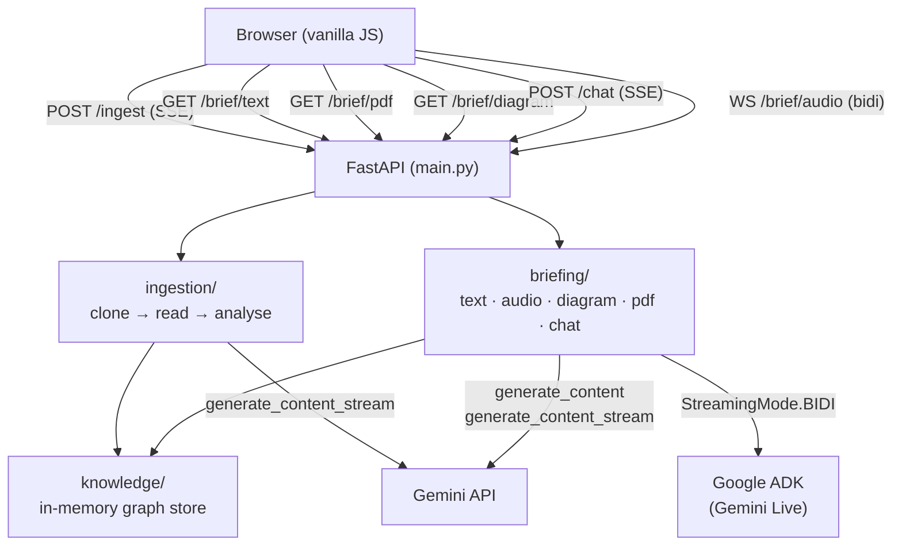
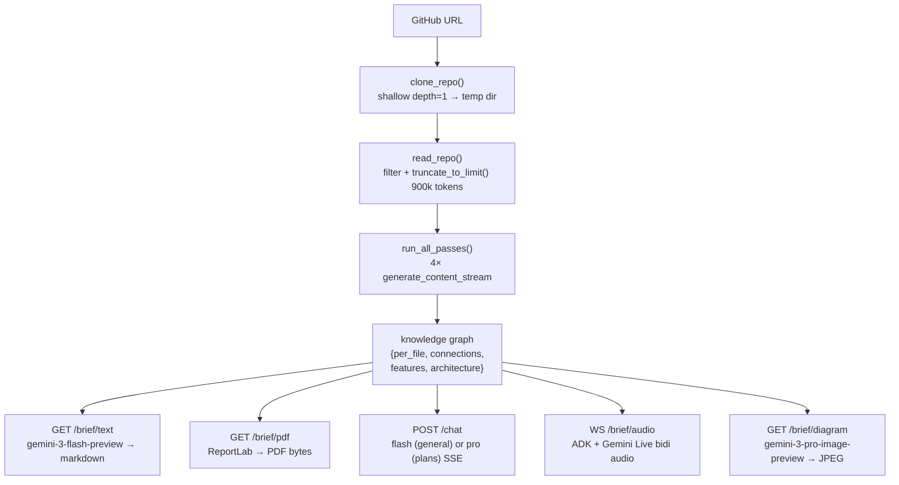

# Compass

Paste a GitHub URL. Get an instant AI-generated brief of the codebase — text, audio, diagram, and PDF — plus a live chat interface and an ambient voice assistant that watches you code.

---

## What it does

1. **Clones** any public GitHub repo into a temp directory
2. **Analyses** it with a 4-pass Gemini pipeline that builds a knowledge graph (file purposes, call graph, features, architecture)
3. **Generates** a structured text brief you can read in 90 seconds
4. **Live Assistant** — bidirectional voice session using Google ADK + Gemini Live: delivers an audio briefing, answers questions, and can trigger implementation plans and architecture diagrams on voice command
5. **Ambient Session** — screen-share + mic mode where the AI watches your screen in real time, proactively comments when it sees something actionable, and flags deviations from your active implementation plan
6. **Architecture Diagram** — generates a visual architecture diagram of the codebase using `gemini-3-pro-image-preview`; expandable fullscreen on click
7. **Exports** a PDF brief (cover page, Mermaid architecture diagram, feature map, file breakdown) via ReportLab
8. **Chats** — persistent multi-turn chat grounded in the knowledge graph; implementation plan requests are automatically routed to the more capable `gemini-3.1-pro-preview` model

Sessions are saved in localStorage and resumable from the sidebar.

---

## Stack

| Layer | Tech |
|---|---|
| Backend | FastAPI + Uvicorn |
| AI — analysis & chat | `gemini-3-flash-preview` via `google-genai` SDK |
| AI — implementation plans | `gemini-3.1-pro-preview` via `google-genai` SDK |
| AI — live assistant | `gemini-2.5-flash-native-audio-preview-12-2025` via Google ADK |
| AI — architecture diagram | `gemini-3-pro-image-preview` via `google-genai` SDK |
| PDF | ReportLab |
| Frontend | Vanilla JS + Web Audio API |
| Repo cloning | GitPython |

---

## Project structure

```
compass/
├── main.py                  # FastAPI app, router registration, static mount
│
├── ingestion/
│   ├── cloner.py            # Clones GitHub repo to a temp dir
│   ├── reader.py            # Reads repo files into a flat string
│   └── extractor.py         # 4-pass Gemini analysis → knowledge graph JSON
│
├── knowledge/
│   ├── graph.py             # Save / load / format knowledge graph per session
│   └── conversations.py     # In-memory multi-turn chat history store
│
├── briefing/
│   ├── text.py              # Generates markdown text brief from knowledge graph
│   ├── audio.py             # ADK bidirectional audio session handler (Live Assistant)
│   ├── agent.py             # ADK Agent + Runner + tool definitions (plan, diagram)
│   ├── session_agent.py     # Separate ADK Agent for ambient screen-watch mode
│   ├── session.py           # Ambient session handler (screen frames + mic + proactivity)
│   ├── chat.py              # Streams chat responses; routes plan requests to Pro model
│   ├── diagram.py           # Generates architecture diagram image via Gemini
│   └── pdf.py               # ReportLab PDF: cover page, Mermaid diagram, tables
│
├── routes/
│   ├── ingest.py            # POST /ingest — SSE streaming ingestion progress
│   ├── text.py              # GET  /brief/text/{session_id}
│   ├── pdf.py               # GET  /brief/pdf/{session_id}
│   ├── chat.py              # POST /chat/{session_id} — SSE streaming chat
│   ├── diagram.py           # GET  /brief/diagram/{session_id} — image generation
│   ├── websocket.py         # WS   /brief/audio/{session_id} — live assistant
│   └── session.py           # WS   /session/audio/{session_id} — ambient session
│
└── frontend/
    ├── index.html           # Single-page app (sidebar, chat, input bar)
    └── js/
        ├── main.js          # App logic, session store, ingestion, chat, buttons
        ├── audio-manager.js # Web Audio playback + mic capture (Live Assistant)
        └── session-manager.js # Screen capture + mic + audio playback (Ambient Session)
```

---

## Architecture

### System overview



### Data flow



For full architectural detail see [ARCHITECTURE.md](ARCHITECTURE.md).

---

## Setup

### 1. Clone and install

```bash
git clone <this-repo>
cd compass
pip install -r requirements.txt
```

### 2. Environment

Create a `.env` file in the `compass/` directory:

```
GOOGLE_API_KEY=your_gemini_api_key_here
```

### 3. Run

```bash
cd compass
uvicorn main:app --reload
```

Open `http://localhost:8000`.

---

## How the 4-pass analysis works

Each pass sends the full repository content to Gemini and streams results live:

| Pass | What it builds |
|---|---|
| Pass 1 | Per-file metadata — purpose, functions, imports, key logic |
| Pass 2 | Call graph — which files call which, data flow between them |
| Pass 3 | Feature map — user-facing features and their entry points |
| Pass 4 | Architecture summary — patterns, frameworks, design decisions |

The four passes are merged into a single knowledge graph JSON saved per session, which grounds all subsequent text, audio, diagram, PDF, and chat outputs.

---

## Live Assistant

The Live Assistant uses Google ADK (`google-adk`) with `StreamingMode.BIDI` for full-duplex conversation:

- Delivers a spoken 3-minute codebase briefing on start
- Answers questions via voice mid-session; interruption is supported at any time
- Transcribes its own speech into the chat window in real time using `output_audio_transcription`
- Triggers **implementation plan** generation in chat on voice command (`request_implementation_plan` tool → routed to `gemini-3.1-pro-preview`)
- Triggers **architecture diagram** generation in chat on voice command (`request_architecture_diagram` tool → routed to `gemini-3-pro-image-preview`)

The frontend captures mic audio at 16 kHz via `ScriptProcessorNode` with echo cancellation enabled and plays back 24 kHz audio using Web Audio API with a 180 ms jitter buffer and gapless pre-scheduled playback. Scheduled `BufferSourceNode`s are tracked and stopped immediately on interruption.

---

## Ambient Session

The Ambient Session (Phase 3) is a proactive AI that watches your screen and listens while you code:

- Captures the screen at 1 fps (1280×720 JPEG) via `getDisplayMedia` and streams frames to the backend alongside mic audio
- Uses `ProactivityConfig(proactive_audio=True)` — the model speaks without being prompted, only when it has something specific and actionable to say
- Injected with the full knowledge graph and the most recent implementation plan from chat history at session start; flags any deviation from the plan in real time
- Same tool set as the Live Assistant (`request_implementation_plan`, `request_architecture_diagram`)
- A silent looping `AudioContext` keeps the browser's audio pipeline alive in background tabs (prevents Chrome throttling)
- Runs as a separate ADK agent (`compass_session`) with its own `InMemorySessionService` to avoid session ID collisions with the Live Assistant

---

## Architecture Diagram

Clicking **📊 Diagram** (or asking the Live Assistant) sends the knowledge graph to `gemini-3-pro-image-preview` with a structured prompt describing the system's architecture, features, and key files. The returned JPEG is displayed in the chat window and is expandable to fullscreen on click.

---

## PDF Export

The PDF is generated with ReportLab and contains:

1. **Cover page** — full-page black background, white Compass logo, wordmark, subtitle
2. **Architecture Overview** — conventions and rules from the knowledge graph
3. **Architecture Diagram** — Mermaid `flowchart TD` built from the knowledge graph and rendered to PNG via [mermaid.ink](https://mermaid.ink)
4. **Feature Map** — table of all features with entry points, files, and descriptions
5. **File Breakdown** — every file with purpose, callers, callees, and key functions

---

## Chat & Implementation Plans

The chat system uses `gemini-3-flash-preview` for general questions. Messages that match implementation-plan intent keywords are automatically routed to `gemini-3.1-pro-preview` for a more detailed, step-by-step response grounded in the actual codebase.

---

## Storage

Compass uses a two-tier storage model — server-side in-memory for live data, browser `localStorage` for persistence across restarts.

### Server-side (in-memory, lost on restart)

| Store | Location | What it holds |
|---|---|---|
| Knowledge graphs | `knowledge/graph.py` — `_store: dict` | Full analysis result per session: `per_file`, `connections`, `features`, `architecture` |
| Conversation history | `knowledge/conversations.py` — `_history: dict` | Multi-turn chat messages per session, capped at 40 entries |
| ADK sessions | `InMemorySessionService` (ADK built-in) | Live Assistant and Ambient Session agent state |

All three are plain Python dicts keyed by `session_id`. There is no database. Data is lost when the server restarts — including on Cloud Run when a new revision is deployed or the container cold-starts after inactivity.

> **Production upgrade path:** replace `_store` and `_history` with Redis (with a 2-hour TTL). ADK's `InMemorySessionService` can be swapped for `VertexAiSessionService` for persistent agent state.

### Client-side (localStorage, survives restarts)

| Key | What it holds |
|---|---|
| `compass_sessions` | Array of up to 20 session objects |

Each session object stored in the browser contains:

```json
{
  "sessionId": "abc123",
  "repoName": "flask",
  "repoUrl": "https://github.com/...",
  "createdAt": "2026-03-16T...",
  "textBrief": "... full markdown string ...",
  "chatHistory": [{ "role": "user", "text": "..." }, ...]
}
```

This means users can reopen past briefs and read prior chat history even after a server restart — they just can't send new chat messages until the server has re-ingested that repo.

---

## Environment variables

| Variable | Description |
|---|---|
| `GOOGLE_API_KEY` | Gemini API key (required) |
